# Mini Marketplace Platform
### 🚀 [Live Demo](https://coalition-scholar-elect-tone.trycloudflare.com/) 🚀
## Overview

Mini Marketplace Platform is a microservices-based e-commerce application that demonstrates production-oriented patterns: event-driven architecture over Kafka, the transactional outbox pattern, idempotency, correlation IDs, and integration with a mock payment provider.

The system exposes three user-facing applications: a Partner Portal (sellers creating and publishing offers), a Buyer Portal (catalog and orders), and an Ops Dashboard (operations and refunds). All HTTP traffic goes through an API Gateway, which routes to backend services (Offer, Payments, Orders, Enrichment) and a Provider Simulator that mocks payment provider callbacks.

## Features

- **Offer lifecycle**: Create offers, optional AI enrichment (title/description via Groq), publish with listing-fee payment flow.
- **Payments**: Create payments, call external provider (simulator), receive webhooks, publish payment events to Kafka; idempotency and webhook signature verification.
- **Orders**: Buyer orders with payment flow; consumption of payment events from Kafka to update order status; refund requests for ops.
- **Event-driven flow**: Kafka topics for `offer.created`, `offer.enriched`, `payment.captured`, `payment.failed`; transactional outbox for reliable publishing.
- **API Gateway**: Single entry point with correlation ID, rate limiting, CORS; routes under `/api/offers`, `/api/payments`, `/api/orders`, `/api/catalog`, `/api/ops`.
- **Observability**: Actuator health/metrics, Prometheus metrics, correlation IDs in logs and Kafka headers.

## Screenshots

### Landing
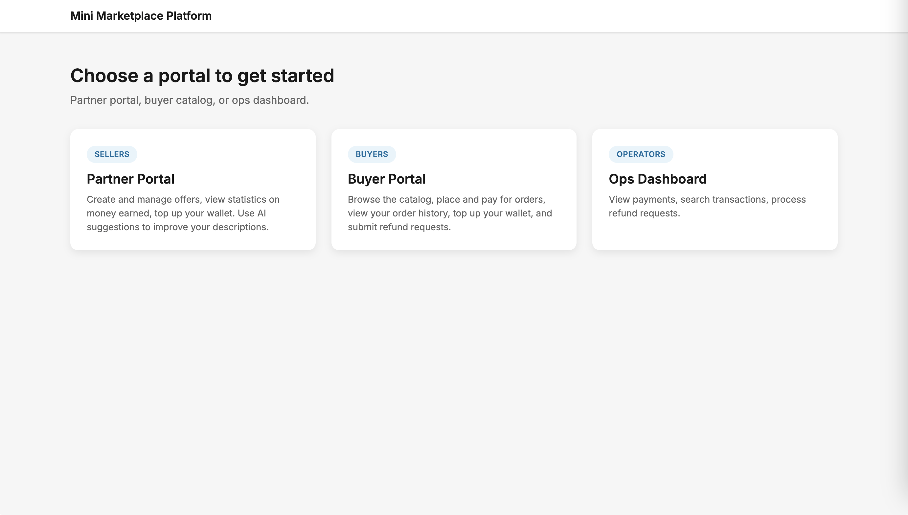

### Partner Portal — Login
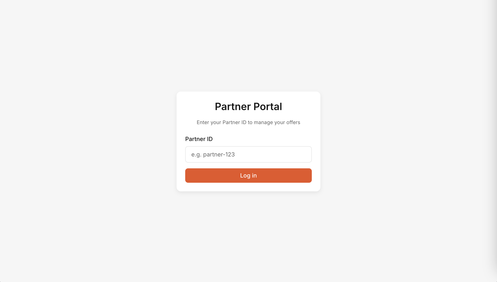

### Partner Portal — My Offers
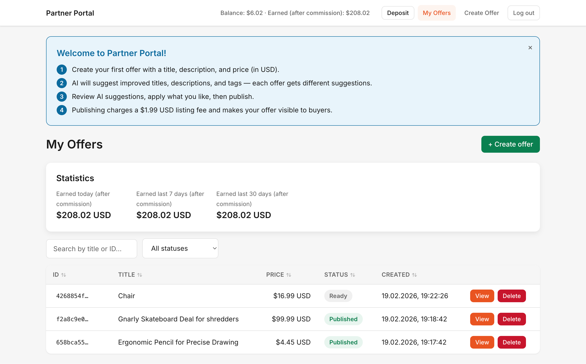

### Partner Portal — Create Offer
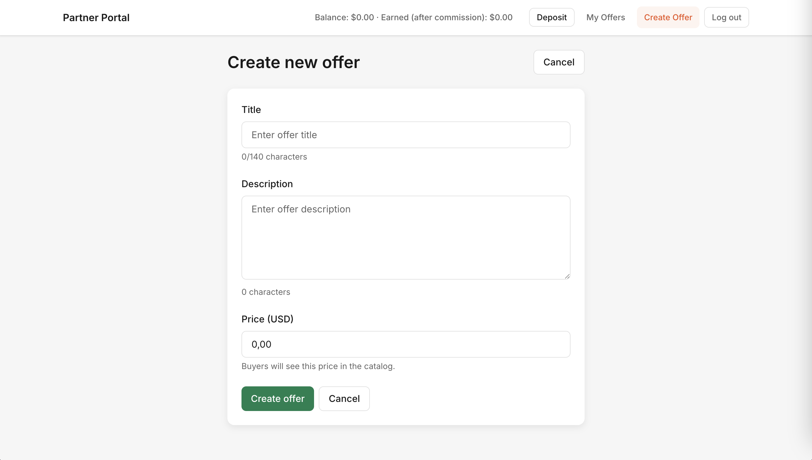

### Partner Portal — Offer Details
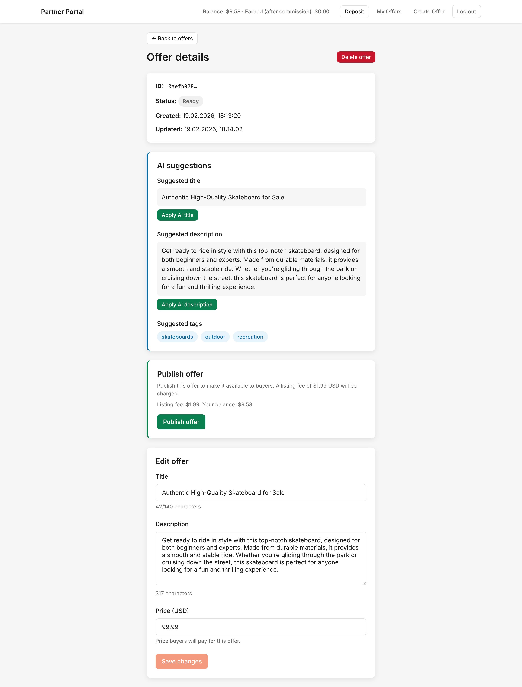

### Buyer Portal — Login


### Buyer Portal — Catalog
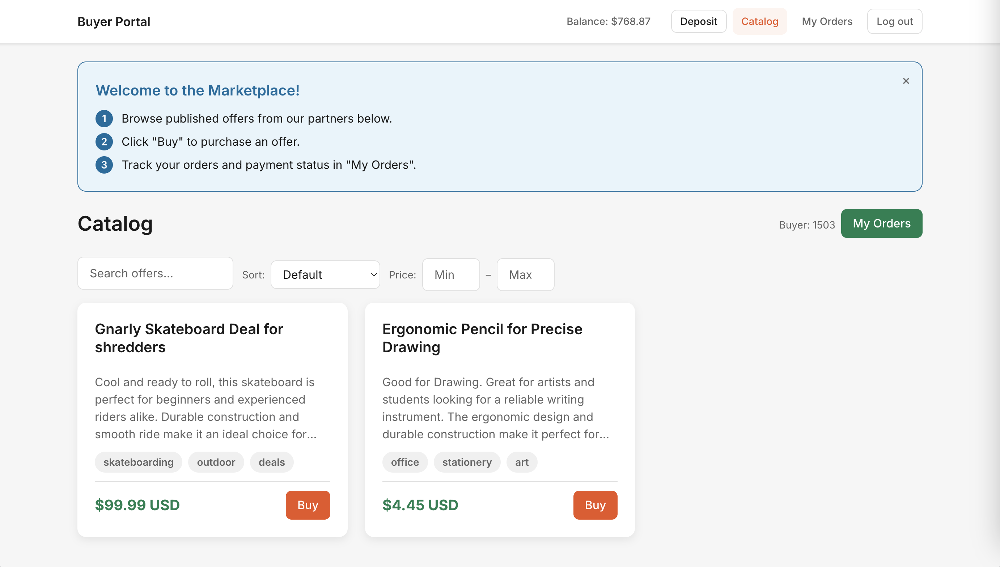

### Buyer Portal — My Orders
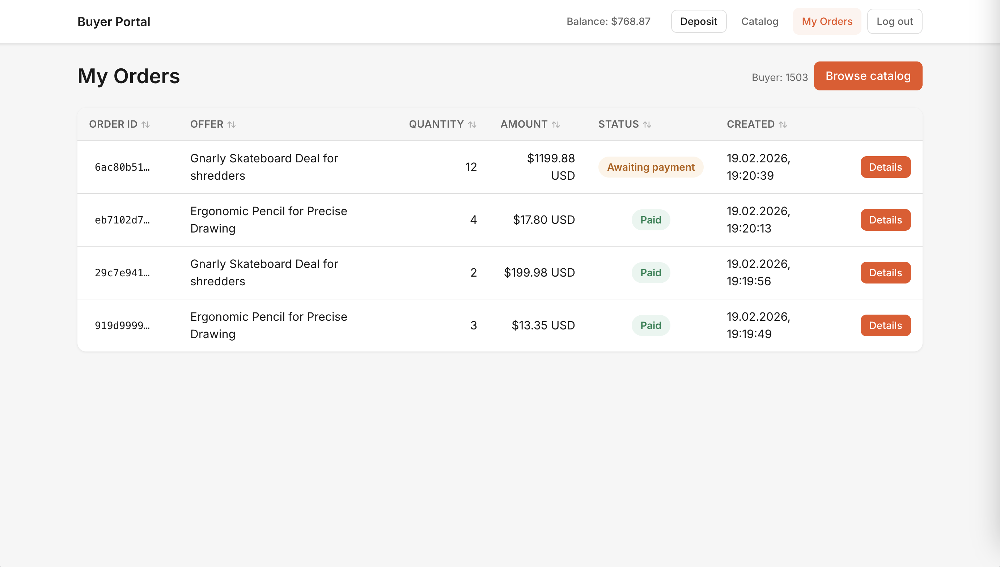

### Buyer Portal — Order Details
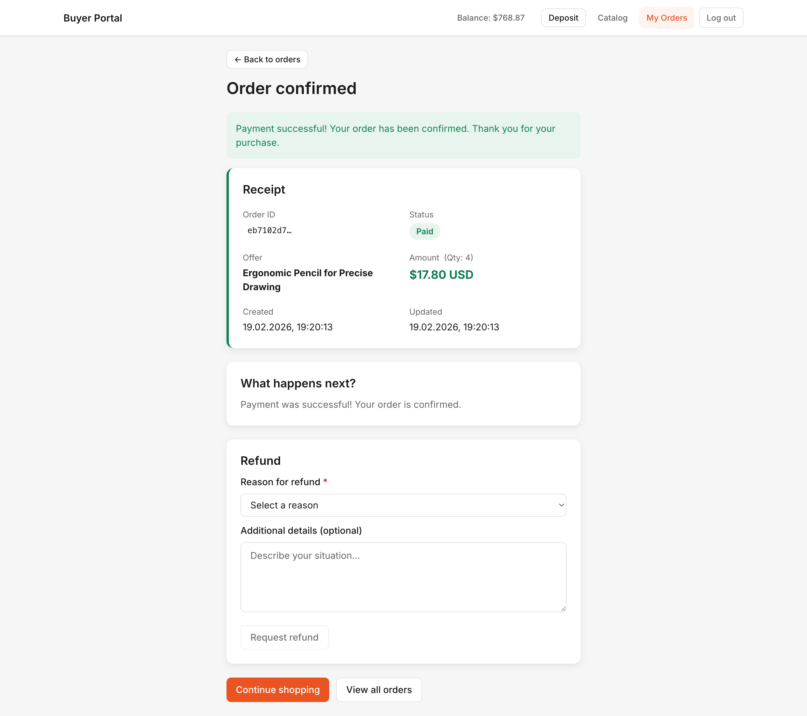

### Ops Dashboard — Login


### Ops Dashboard — Search
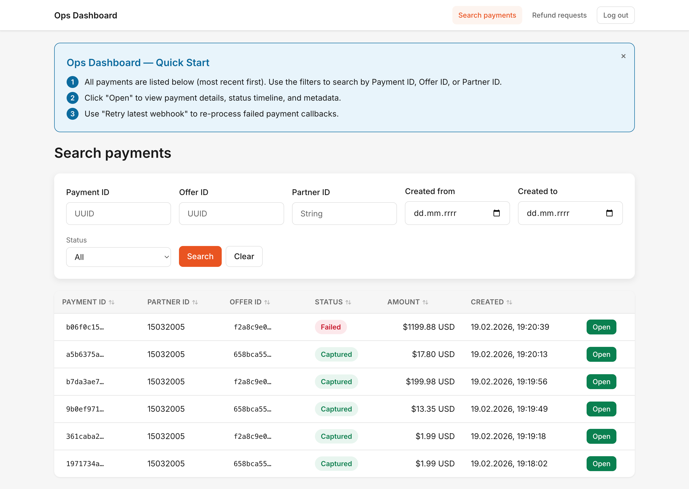

### Ops Dashboard — Payment Details
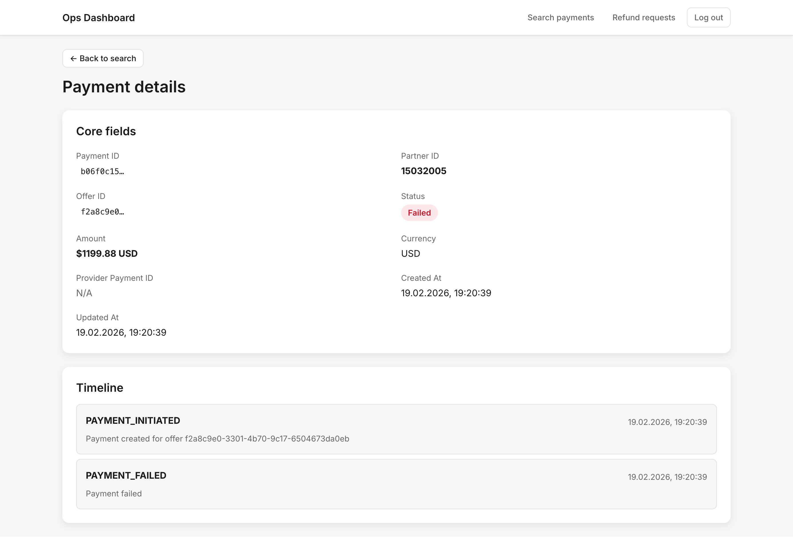

### Ops Dashboard — Refund Requests
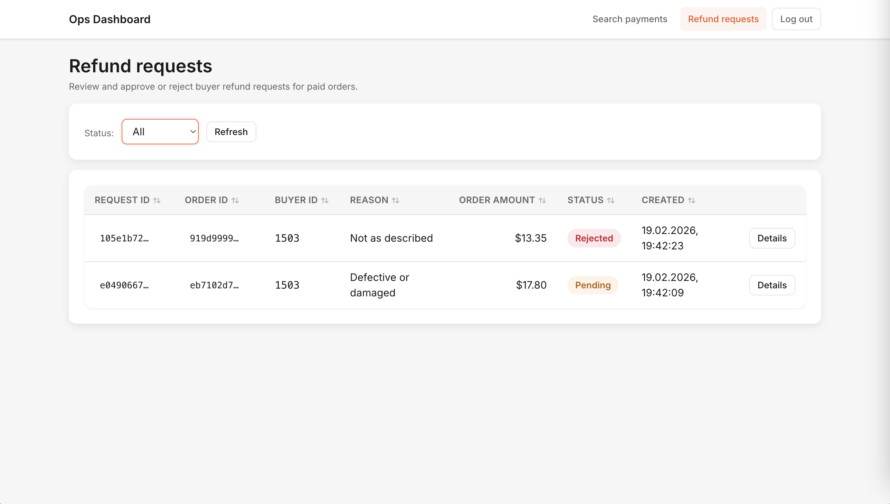

## Tech Stack

- **Backend**: Java 21, Maven, Spring Boot 4.0.2, Spring Cloud Gateway (gateway), Spring Kafka, Spring Data JPA, SpringDoc OpenAPI (Swagger).
- **Database**: PostgreSQL; Flyway migrations in offer-service, payments-service, orders-service.
- **Messaging**: Apache Kafka (single broker in Docker).
- **Frontends**: Vite, React.
- **Containers**: Docker and Docker Compose for infra and full-stack runs.

## Architecture / Module Structure

```
.
├── services/
│   ├── gateway/             # API Gateway (Spring Cloud Gateway): routing, correlation ID, rate limiting
│   ├── offer-service/       # Offers CRUD, publish flow, outbox, Kafka consumer for offer.enriched
│   ├── payments-service/    # Payments, provider client, webhooks, outbox, Kafka consumer/producer
│   ├── orders-service/      # Orders, refund requests, Kafka consumer for payment events
│   ├── enrichment-service/  # Kafka consumer for offer.created, optional Groq AI enrichment, producer offer.enriched
│   └── provider-simulator/  # Mock payment provider: accepts payment requests, sends webhooks to payments-service
├── frontends/
│   ├── partner-portal/      # Partner UI (offers, publish)
│   ├── buyer-portal/        # Buyer UI (catalog, orders)
│   ├── ops-dashboard/       # Operations UI (payments, refunds)
│   └── landing/             # Static landing with links to the three apps
├── infra/                   # Docker Compose: PostgreSQL, Kafka, optional Kafka UI; full stack or infra-only
└── scripts/                 # start-all.sh, stop-all.sh
```

Each backend service has its own Maven module and `pom.xml`. The gateway does not use a database; offer-service, payments-service, and orders-service each use a dedicated PostgreSQL database (offer_db, payment_db, order_db) created by `infra/postgres/init.sql`.

## Requirements

- **For full stack via Docker**: Docker and Docker Compose.
- **For local development**: JDK 21, Maven, Node.js (for frontends), Docker and Docker Compose (for PostgreSQL and Kafka).

## Configuration

Configuration is done via `application.yml` in each service (under `src/main/resources`) and overrides with environment variables. Profile `docker` is used when running in Docker (e.g. gateway uses `application-docker.yml` for service-name URIs).

**Backend (typical env vars):**

- `SPRING_DATASOURCE_URL`, `SPRING_DATASOURCE_USERNAME`, `SPRING_DATASOURCE_PASSWORD` — PostgreSQL (per service).
- `SPRING_KAFKA_BOOTSTRAP_SERVERS` — Kafka bootstrap (e.g. `localhost:9092` or `pet-kafka:9092` in Docker).
- `PAYMENT_SERVICE_URL` — Used by offer-service and orders-service to call payments-service (e.g. `http://localhost:8082`).
- `OFFER_SERVICE_URL` — Used by orders-service (e.g. `http://localhost:8081`).
- `PROVIDER_BASE_URL` — Used by payments-service to call the provider simulator (e.g. `http://localhost:8084`).
- `PROVIDER_WEBHOOK_SECRET` — Shared secret for webhook signature verification (payments-service and provider-simulator).
- `GROQ_API_KEY` — Optional; enables AI title/description in enrichment-service (Groq API). Leave unset for rule-based fallback.
- `GROQ_MODEL` — Optional; Groq model (default in config: `llama-3.1-8b-instant`).

**Frontends:**

- `VITE_API_URL` or `VITE_API_BASE_URL` — Backend API base URL (e.g. `http://localhost:8080` for gateway). Buyer portal build can use `GATEWAY_PUBLIC_URL` in Docker build args.

## Running Locally

### Full stack with Docker (recommended for a single-command run)

From the repository root:

```bash
make up
```

or:

```bash
./scripts/start-all.sh
```

or:

```bash
cd infra
docker compose -f docker-compose.full.yml up -d --build
```

Stop with `make down`, or `./scripts/stop-all.sh`, or `cd infra && docker compose -f docker-compose.full.yml down`.

This starts PostgreSQL, Kafka, gateway, offer-service, payments-service, orders-service, enrichment-service, provider-simulator, landing, partner-portal, ops-dashboard, and buyer-portal. No Kafka UI in this compose file.

**Useful URLs (when running locally):**

- Landing: http://localhost:80 (when served via Docker) or open `frontends/landing/index.html` locally.
- Partner Portal: http://localhost:3000
- Buyer Portal: http://localhost:3002
- Ops Dashboard: http://localhost:3001
- API Gateway: http://localhost:8080
- Swagger: Offer Service http://localhost:8081/swagger-ui.html, Payments http://localhost:8082/swagger-ui.html, Orders http://localhost:8085/swagger-ui.html
- Kafka UI: http://localhost:8089 (when using `docker-compose.infra.yml`).

## Database / Migrations

PostgreSQL is used. Databases `offer_db`, `payment_db`, and `order_db` are created by `infra/postgres/init.sql` when the Postgres container starts.

Flyway is enabled in **offer-service**, **payments-service**, and **orders-service**. Migrations live under `src/main/resources/db/migration/` in each service. Schema is applied on startup; `spring.jpa.hibernate.ddl-auto` is set to `validate` so that Flyway owns the schema.

## Tests

Backend tests use JUnit and, where applicable, Testcontainers (PostgreSQL). Run tests per service:

```bash
cd services/offer-service
mvn test

cd services/payments-service
mvn test

cd services/orders-service
mvn test
```
